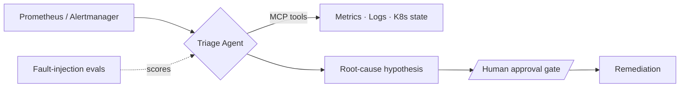

<div align="center">


<br/>

[](https://www.linkedin.com/in/jeel3105/)
[](https://jeelpatel.net)
[](mailto:pateljeel3105@gmail.com)
[](https://ieeexplore.ieee.org/document/10526152)


</div>


## `> boot --profile`

```ts
const jeel = {
  education : "MS Computer Engineering, NYU Tandon (2026)",
  focus     : ["Distributed systems", "HPC infrastructure", "SRE / observability", "Agentic AI"],
  experience: ["NYU HPC Research Lab (Research Lead)", "The NorthStar Group (SRE/Backend)", "5POINT Solutions (Low-latency C++)"],
  philosophy: "Measure it. Automate it. Make it boringly reliable.",
  shipping  : "Systems that survive contact with production",
  status    : "Open to full-time software engineering roles",
} as const;
```

<div align="center">

| 🖥️ **120** | 📡 **4M+** | 👥 **100K+** | 📄 **1** |
|:---:|:---:|:---:|:---:|
| GPU nodes managed | telemetry events / day modeled | MAU platform kept reliable | IEEE publication |

</div>

## `> ls ./flagship-projects`

### 🛰️ Incident Triage Agent &nbsp;·&nbsp; `in active development`
> An on-call agent that reads alerts, investigates, and proposes fixes. A human approves before anything runs.



- **Human-in-the-loop by design:** no action executes without approval
- **Evaluated, not vibes-checked:** fault-injection harness scores the agent's diagnoses
- **Fully local and free:** Ollama + kind + open-source tooling
- `Python` `MCP` `Prometheus` `Alertmanager` `Kubernetes` `Ollama`

<br/>

### 🧬 TR4: Generative Telemetry Pipeline &nbsp;·&nbsp; `NYU HPC Research`
> Two-stage generative model (CVAE + GRU) that learns the behavior of HPC job telemetry at **4M+ events/day**.

- Trained on the **MIT Supercloud** dataset on **NYU Greene**, with infrastructure debugging along the way (NFS stalls, cuDNN faults, scaler corruption)
- Weekly reporting cadence with advisor **Prof. Yuzhang Lin**
- `PyTorch` `CUDA` `CVAE` `GRU` `Slurm` `Jupyter`

<br/>

### 🧾 Invoice Extractor E2E &nbsp;·&nbsp; `Vision-Language IE`
> LayoutLMv3 + OCR heuristics → structured data → Google Sheets / Excel, behind a FastAPI service with a Next.js UI.

- `LayoutLMv3` `FastAPI` `Next.js` `Docker` `OCR`

<br/>

<div align="center">

| 🩺 **Medical RAG Chatbot** | 🅿️ **Smart Parking IoT** | 📹 **Short-Video Recommender** |
|:---|:---|:---|
| PDF ingest → embeddings → **Pinecone** → grounded medical Q&A with sharply reduced hallucination. | Arduino UNO R4 WiFi + ultrasonic sensors → live occupancy portal, **<500ms** hardware-to-browser. | CountVectorizer + cosine similarity recs on Flask + Firebase + React, deployed to real users. |
| `RAG` `Pinecone` `LLM` | `Arduino` `WebSockets` | `Flask` `React` `NLP` |

| 🎮 **VRAMWatch** | 🚕 **NYC Taxi Demand Forecast** | 🔎 **OCR Extraction Pipeline** |
|:---|:---|:---|
| GPU/VRAM monitoring tool with LLM-powered insights via the Anthropic SDK. | LangGraph-orchestrated forecasting pipeline over NYC taxi data. | OpenCV + Tesseract pipeline orchestrated with the OpenAI Agents SDK. |
| `Python` `Anthropic SDK` | `LangGraph` `Forecasting` | `OpenCV` `Tesseract` |

</div>

> 🔗 More on [github.com/Jex2l](https://github.com/Jex2l)

## `> cat ./stack.json`

<div align="center">

**Systems & Languages**<br/>
[](#) [](#) [](#) [](#) [](#) [](#)

**Infra & Observability**<br/>
[](#) [](#) [](#) [](#) [](#) [](#) [](#)

**Messaging & Data**<br/>
[](#) [](#) [](#) [](#) [](#)

**ML & AI**<br/>
[](#) [](#) [](#) [](#) [](#)

`gRPC` · `CUDA` · `Triton` · `Slurm` · `MCP` · `LangGraph` · `Ollama` · `Pinecone`

</div>

## `> tail -f ./experience.log`

```text
[2025-26]  NYU HPC Research Lab       Graduate Research Lead     120-node GPU cluster · generative telemetry modeling
[prev]     The NorthStar Group        SRE / Backend Engineer     100K+ MAU platform · Kafka · gRPC · K8s · Prometheus/Grafana
[prev]     5POINT Solutions           Software Engineer          Low-latency C++ systems
```

## `> stats --github`

<div align="center">


</div>

## `> currently --exploring`

- 🤖 **Agentic reliability:** evals, approval gates, and safe tool use for ops agents
- 🔭 **Observability for ML and GPU fleets:** telemetry, anomaly detection, capacity signals
- ⚡ **Low-latency systems:** C++ performance and tail-latency work

## `> connect`

<div align="center">

*Hiring for systems, infra, SRE, or applied AI? Let's talk.*

[](mailto:pateljeel3105@gmail.com)
[](https://www.linkedin.com/in/jeel3105/)


</div>
