


 


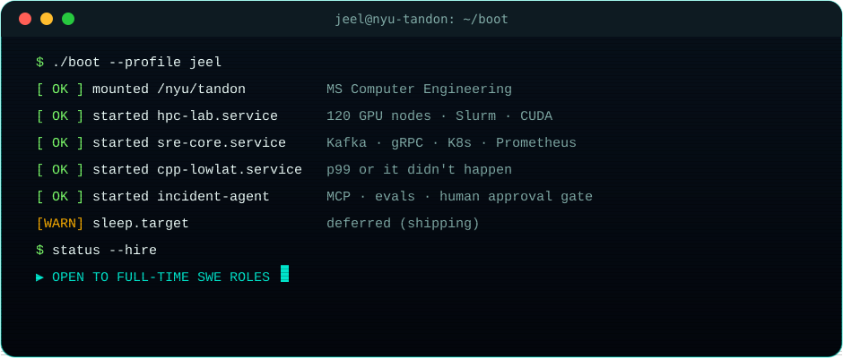


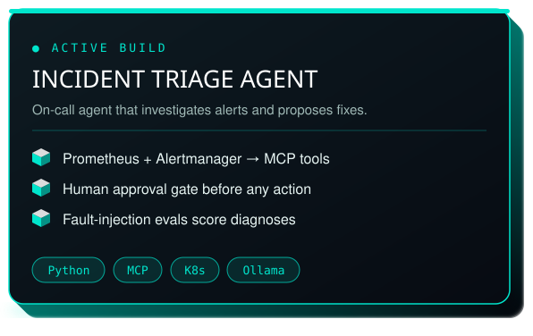
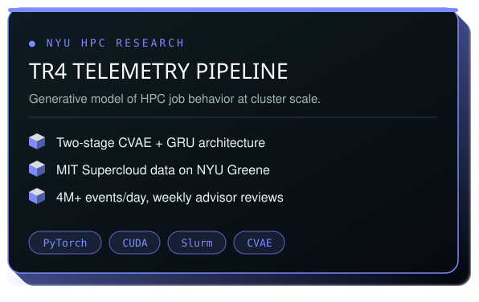
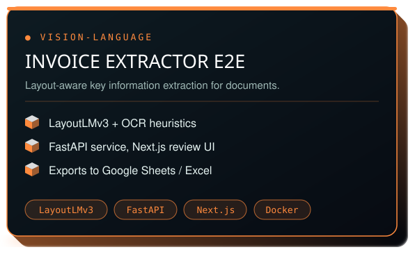






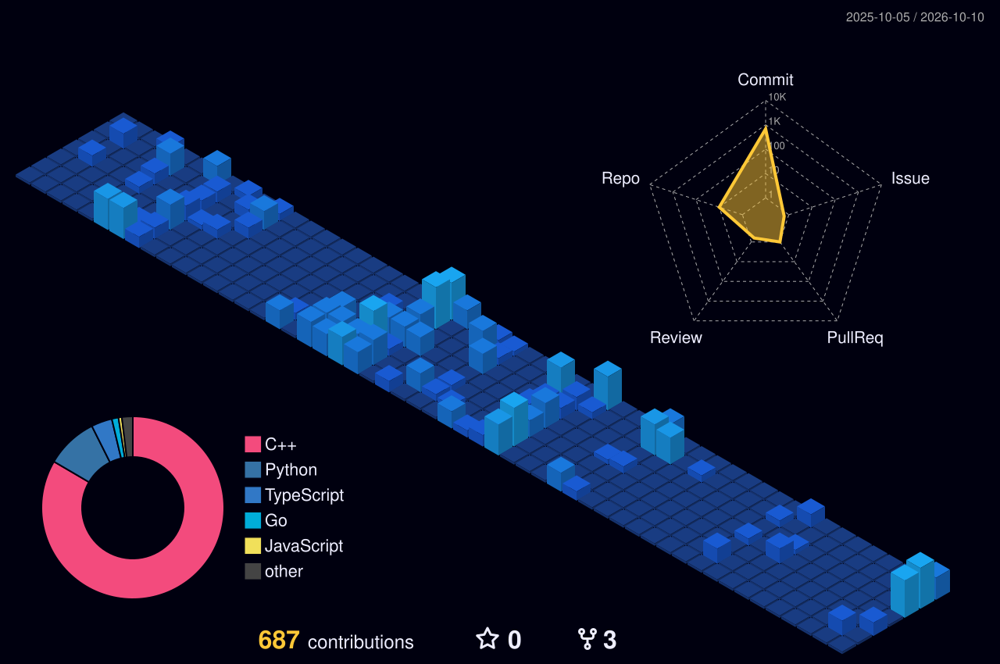


| 🩺 **Medical RAG Chatbot** | 🅿️ **Smart Parking IoT** | 📹 **Short-Video Recommender** |
|:---|:---|:---|
| PDF ingest → embeddings → **Pinecone** → grounded medical Q&A. | Arduino UNO R4 WiFi + ultrasonic sensors → live portal, **<500ms**. | CountVectorizer + cosine similarity recs on Flask + Firebase + React. |

| 🎮 **VRAMWatch** | 🚕 **NYC Taxi Forecast** | 🔎 **OCR Pipeline** |
|:---|:---|:---|
| GPU/VRAM monitor with LLM insights (Anthropic SDK). | LangGraph-orchestrated demand forecasting. | OpenCV + Tesseract with the OpenAI Agents SDK. |

 

 

*Hiring for systems, infra, SRE, or applied AI? Let's talk.*

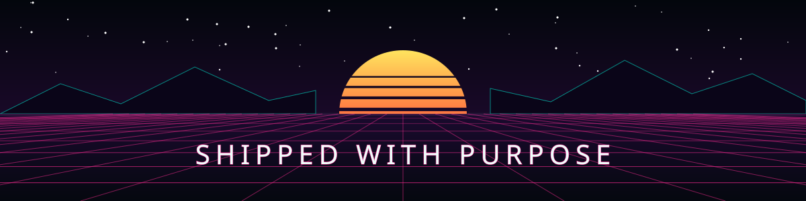
